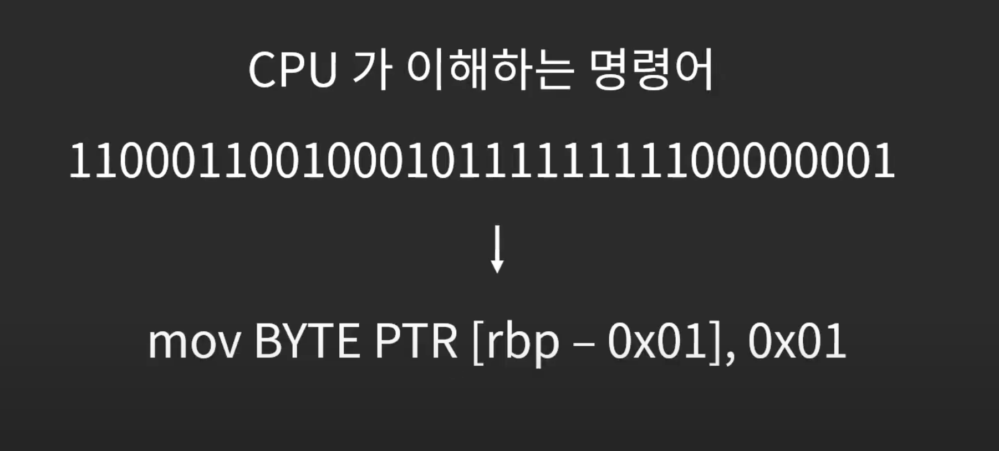

컴퓨터 구조에 대해 큰 그림을 이해하기 위해 초간단하게 작성해보았습니다 :)

## 그래서 컴퓨터란 도대체 **뭘까**?
결론부터 말하자면 컴퓨터는 '계산기'다.
그러면 단순한 쌀집 계산기와 무슨 차이가 있는 것인가?
> 컴퓨터는 스스로 **명령어**를 **읽어**들여서 **연산**을 수행할 수 있다.

## **누가** 명령어를 읽고 연산을 수행하는가?
### CPU(Central Process Unit)
CPU(Central Process Unit)는 메모리에 저장된 명령어를 읽어 들이고, 읽어드린 명령어를 해석하고, 실행하는 부품이다. 1초에 10억번 이상의 연산 가능하다.
즉, 컴퓨터에서 명령어를 읽고 연산을 수행하는 것은 **CPU**다.

### CPU 구성요소
CPU 내부 구성 요소 중 가장 중요한 세 가지는 [산술논리연산장치(Arithmetic Logic Unit) 이하 ALU](https://en.wikipedia.org/wiki/Arithmetic_logic_unit), [레지스터(Register)](https://en.wikipedia.org/wiki/Processor_register), [제어장치(Control Unit)](https://en.wikipedia.org/wiki/Control_unit)가 이 있다.

ALU
- ALU는 쉽게 말해 계산기로 계산만을 위해 존재하는 부품이다.
- 컴퓨터 내부에서 수행되는 대부분의 계산을 수행한다.

레지스터
- CPU 내부의 연산을 수행하기 위한 작은 임시 저장 장치이다.
- CPU 안에는 여러 개의 레지스터가 존재하고 각기 다름 이름과 역할을 가지고 있다.
- 64비트 CPU에 경우 레지스터는 8바이트 짜리 총 16개로 이루어져 있다.

제어장치
- **제어 신호(Control Unit)** 라는 전기 신호를 내보내고 명령어를 해석하는 장치이다.
- 제어신호란 컴퓨터 부품들을 관리하고 작동시키기 위한 일종의 전기 신호이다.
- CPU가 메모리에 저장된 값을 읽고 싶을 땐 `메모리 읽기`라는 제어 신호를 보낸다.
- CPU가 메모리에 어떤 값을 저장하고 싶을 땐 `메모리 쓰기`라는 제어 신호를 보낸다.

## **어디**에서 명령어를 읽는가?
CPU에는 레지스터라는 내부의 작은 임시 저장 장치가 있다고 했다.
그러면 레지스터에 모든 명령어를 저장하는 것이 좋은 것 아닌가? 라고 할 수 있다
물론, CPU에서 모든 연산들이 이루어지기 때문에 당연히 CPU에 명령어를 저장하는 것이 효율적일 것이다.

하지만, CPU는 연산에 특화되어 있는 장치이기 때문에 실제로 데이터를 저장할 수 있는 공간(레지스터)은 굉장히 작다. 물론 레지스터는 CPU안에 있는 메모리이기 때문에 CPU에서 연산수행 시 매우 빠르게 접근할 수 있지만, 기술의 한계상 레지스터의 개수를 늘리는 것은 어렵다.

레지스터는 64비트 CPU에 경우 레지스터는 8바이트 짜리 총 16개로 이루어져 있다고 했다.
결국 CPU에 저장할 수 있는 데이터의 최대 양은 많아야 128바이트 정도 밖에는 안된다.
따라서, CPU는 반드시 **저장에 특화된 장치**가 따로 필요하다.

### 메모리
메모리는 현재 실행되는 프로그램의 명령어와 데이터를 저장하는 부품이다. 즉, 프로그램이 실행되려면 반드시 메모리에 저장되어 있어야한다.

메모리에는 저장된 값에 빠르고 효율적으로 접근하기 위해 **주소(Address)** 라는 개념을 사용한다.
이 주소를 통해 메모리에 저장된 값의 위치를 주소로 알 수 있다.
메모리는 1바이트의 연속된 공간으로 이루어져 있다.

컴퓨터에서 메모리는 보통 **RAM**을 지칭한다.

## **어떻게** 명령어를 작성하는가?
### CPU가 알아듣는 명령어 체계
CPU마다 설계하는 방식이 여러가지가 있는데 이 때문에 CPU마다 사용하는 명령어 체계가 다르다.
CPU마다 알아들을 수 있는 명령어 집합 구조를 ISA(Instruction set architecture) 라고 한다.

ISA는 여러가지 종류가 있는데 Intel x86, ARM, RISC-V 등이 있다.
ISA는 저마다 다르기 때문에 x86 기반에 CPU가 ARM ISA로 작성된 코드를 받는 다면 전혀 실행할 수 없게 된다.

우리가 해당 CPU에 ISA를 보고 명령어를 작성한다면 CPU에 아래와 같이 이진 데이터로 이루어진 명령어들이 전달된다.

문제는 CPU가 이해하는 명령어는 결국 숫자들의 나열이기 때문에 사람들이 이해하기 심히 어렵다는 점이다.
따라서 아래와 같이 이진수의 형태로 표현된 명령어를 사람이 그나마 이해하기 쉽게 대응시켜서 나타낸 것이 **어셈블리(Assembly)** 다.

### CPU가 명령어를 읽어 들이는 방법
- CPU는 어디에서 실행할 명령어를 가저올까? RAM
- 그러면 RAM 어디에서 가져올지 어떻게 알지? RIP(명령어 주소 레지스터)

### 프로그램을 실행한다는 의미
- 운영체제가 우리가 실행하고자 하는 프로그램 명령어들을 하드디스크에서 RAM에 복사한 후 해당 프로그램에서 실행되어야 하는 첫 번째 명령어의 위치로 CPU의 RIP 레지스터 값을 설정 하는 것

> 정리하면 우리가 CPU에 명령을 내리기 위해서는 CPU의 ISA에 맞게 어셈블리로 명령어를 작성하면 된다.

하지만 어셈블리는 사람이 이해하기에 굉장히 난해하다.
따라서, 컴퓨터 과학자들은 사람이 그나마 이해하기 쉽게 명령어를 작성한 다음 이를 각 CPU에 맞게 어셈블리로 만들어 주는 프로그램을 생각 하였다.
이로써, 탄생한 것이 사람이 이해하기 쉽게 작성하는 명령어를 **프로그래밍 언어(Programming Language)** 라고 하고, 어셈블리로 바꿔주는 과정을 **컴파일(Compile)** 이라고 한다.

## Reference
* [내가 C 언어를 공부하기 전에 알았으면 좋았을 것들](https://modoocode.com/315)

